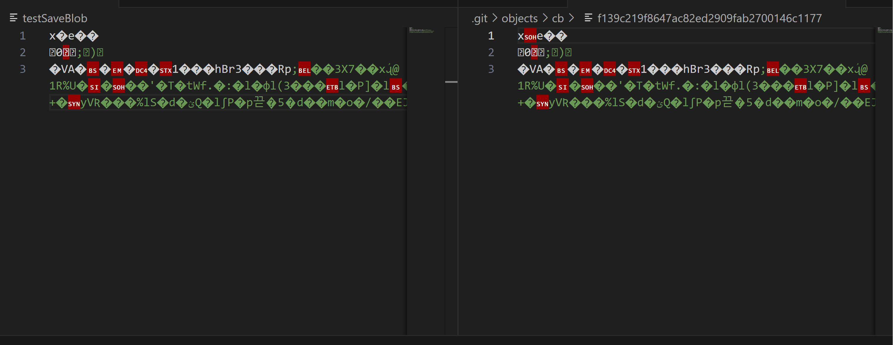

# HaskGit

Team members:

- James Oh
- Jack Oh
- Chen Guo

## Summary Description

HaskGit is a Git implementation using Haskell. The goal of the project is to implement core git commands with Haskell.

## Modified MVP
We realized that the scope of the project might have been a little large; hence, we decided to remove some commands from the MVP in the proposal. The removed commands are `git init`, `git rebase`, and `git restore`. We aimed to select commands that are more interesting and do not require handling merge conflicts. Even after removing these commands, we believe the project is still very interesting to explore with Haskell, and the scope of the project remains large. Of course, if time permits, we will implement other interesting commands.

Command list

Commands that will be implemented for MVP:

- Basic Snapshotting.
  - add: Adds file contents to the index (which means move to staging area).
    ```
    haskgit add filename
    ```
  - status: Displays differences between the index file and the current HEAD commit, paths that have differences between the working tree and the index file, and paths in the working tree that are not tracked by Git.
    ```
    haskgit status
    ```
  - commit: Creates a new commit containing the current contents of the index.
    ```
    -- '-m' flag is required for MVP
    haskgit commit -m "Some commit message"
    ```
  - reset: Resets the current HEAD to the specified state. This command will be interesting to implement.
    ```
    -- this will unstage all changes
    haskgit reset

    -- Move the branch pointer to specific commit
    haskgit reset commit-hash
    ```
- Branching and Merging
  - branch: Lists, creates, or deletes branches.
    ```
    -- list the branch
    haskgit branch

    -- create new branch
    haskgit branch branch_name
    ```
  - checkout: Switches branches or restores working tree files.
    ```
    haskgit checkout branch-name

    haskgit checkout commit-hash  
    ```

- Inspection and Comparison
  - show: Shows a git object. In the standard 'git show' behavior, it includes the specified commit and the differences. However, for the project's scope, the diff part will be not displayed.

    ```Console
    haskgit show hash_value

    -- show latest commit
    haskgit show  
    ```

  - log: Show commit logs
      ```
      haskgit log
      ```

- Patching
  - revert: Reverts exiting commit. 
    ```
    haskgit revert commit-hash
    ```


## Checkpoint Progress Summary

After adjusting our approach to explore with small commands and then building up some core functions based on the patterns we found, the parts we implemented are slightly different from the ones proposed in the initial proposal. However, we still believe that we have made significant progress in this project by developing core functions that can be utilized in many other command functions. Of course, there is still a lot of work to be done until we reach the MVP. Here is a brief summary of the progress we have made up to this checkpoint.

1. Modifying design: 

    A lot of things are happening inside Git, so we had to spend a lot of time researching the concept. There were many details we did not realize during the proposal, and there were too many I/Os happening inside Git to follow the "Functional core/Imperative shell" design pattern. If we were to follow this design pattern, we would have to read the entire Git directory into memory for every single Git command. This was not ideal, so we decided to reject such a design pattern and instead follow the simple MVC pattern.

    **LESSON**: Always think about the problem we are solving first. Don't try to fit the problem into the design pattern.


2. Load/Save GitObjects:

    We implemented a parser that reads various types of Git objects (blob, tree, and commit objects) and created a function to save Git objects from memory to disk. These functions serve as foundational elements, as they can be utilized in any Git command functions that interact with Git objects. The names of these functions are `GitParser.parseGitObject` and `HaskGit.saveGitObject`.

    You might realize that when we read in the Git object and save it using the functions we mentioned above, the resulting file is **different** from the original file, which is unexpected. For instance, the file `experiments/testSaveBlob` is read and saved as a Git object file using `.git/objects/f6/f754dbe0808826bed2237eb651558f75215cc6`. Upon comparing these two files, it becomes evident that they are different. Although we spent a significant amount of time debugging this, all of the logic in our code seemed to be correct.

    To investigate further, we decided to decompress both files and compare the outputs (`experiments/decompActualBlob` and `experiments/decompTestSaveBlob`). Surprisingly, the outputs were exactly the same. After conducting some research, we concluded that the compression algorithm may produce different files under various conditions, such as the operating system and compression level. More information on this behavior can be found here: https://stackoverflow.com/questions/26516369/zlib-gzip-produces-different-results-for-same-input-on-different-oses.

    While we may need to conduct additional research to precisely understand what is happening inside zlib (potentially an interesting topic for future reading), we have decided to assume that our current implementation is correct since the decompressed data is identical. 

    **LESSON**: Never assume that compressed data will be always the same just because the inputs are same.

    Decompressed version of the files are same:
    

3. `haskgit show` command

    The `haskgit show` command is equivalent to the `git show` command with some restrictions (it takes only a hash value as an argument and does not show any diff). This command was the first function we implemented to explore how we could implement other Git commands. The example outputs of the `haskgit show` command are as follows:"

      An example of tree show
      ```
        PS C:\Users\james\Documents\CS541\HaskGit> .stack-work/dist/22605e11/build/HaskGit-exe/HaskGit-exe show f6e1af0b636897ed62c8c6dad0828f1172b9b82a
        tree f6e1af0b636897ed62c8c6dad0828f1172b9b82a

        .gitattributes
        .gitignore
        README.md
        assets
        docs
      ```

      An example of commit show
      ```
        PS C:\Users\james\Documents\CS541\HaskGit> .stack-work/dist/22605e11/build/HaskGit-exe/HaskGit-exe show 562c9c7b09226b6b54c28416d0ac02e0f0336bf6
        commit 562c9c7b09226b6b54c28416d0ac02e0f0336bf6
        Author: James Oh <jo9347@cs.rit.edu>
        Date:   Thu Nov  9 14:33:38 2023 -0500

            Change content to bytestring

        PS C:\Users\james\Documents\CS541\HaskGit> 
      ```

4. Read/write index file: 

    This was one of the most challenging parts of the project so far because it was difficult to debug what went wrong when dealing with the binary file. If we misinterpret one byte, the parser will simply fail, and the output binary file will be completely different from the expected output (at least when you look at the encoded version of the file). However, we were able to successfully parse the git version 2 index file (we are not considering any other version for MVP) and reproduce the same index file by parsing the index file and saving it. These functions will be useful for any command that interacts with the index file (e.g., git add, git status, etc).

    If you use the `testSaveIndex` file in `Experiment.hs`, it will read the `.git/index` file and load it into memory, and then save it in the `testIndex` file. We were able to reproduce the same index file (if you are testing this locally, make sure your index file is not corrupted or in use).

    The Diff command on original index file and reproduced index file:

    ```
      james@DESKTOP-531QK4A MINGW64 ~/Documents/CS541/HaskGit (main)
      $ diff .git/index testIndex 

      james@DESKTOP-531QK4A MINGW64 ~/Documents/CS541/HaskGit (main)
    ```

     **LESSON**: Converting 23 into "23" will change the underlying byte value. It is simple concept, but don't forget this when you are dealing with binary file.

5. `hashObject` function:

    The `hashObject` function takes two arguments: the GitObject and a boolean flag. It returns the hash value of the object as a bytestring. If the flag is true, it also saves the git object in the `.haskgit/object/` directory. The return type of this function is `IO ByteString` since it needs to save the git object when the flag is true. This function will be used whenever git commands need to get hash of the object or save a new git objects.

    The `hashObject` is implemented as follows:
    * Serialize the git object using `gitObjectSerialize` in `GitObject.hs`. This function serializes the git object by concatenating the header and appropriate content format based on the git object type as a bytestring.
    * Apply SHA1.Hash to the serialized content to obtain the hash value.
    * If the flag is true, save the object by calling `saveGitObject` in `GitObject.hs`. The directory is `.haskgit/objects/(first two of hash)/(rest of hash)`. For example, if the hash is `f6e1af0b636897ed62c8c6dad0828f1172b9b82a`, the object will be saved at `.haskgit/objects/f6/e1af0b636897ed62c8c6dad0828f1172b9b82a`.

    ```haskell
    -- Example usage of gitHashObject in Haskell code
    -- gitHashObject :: GitObject -> Bool -> IO ByteString

    -- Code below will save the git hash object to the .haskgit/objects directory and return the hash value
    do 
      ...
      -- Assume 'obj' is some git object
      hash <- gitHashObject obj True
      return hash
    ```

6. Locate `.haskgit` directory:

    To execute Git commands, locating the `.git` directory is crucial. Git clients ascend the directory hierarchy until they encounter the `.git` directory. Our `getGitDirectory` function accomplishes this and will be a frequently used function in Git command operations.

    To maintain the cleanliness of the original `.git` directory, the function returns the `.haskgit` directory (which mean we need to create `.haskgit` directory). The helper function `findGitDirectory` takes a filepath as an argument and recursively traverses parent directories until it finds `.haskgit`. The `getGitDirectory` function simply obtains the current directory and passes it to `findGitDirectory` to locate the `.haskgit` directory.

    While we currently assume that the `.haskgit` directory will always exist when running the commands, if `findGitDirectory` cannot locate it, it will return ~ or /, representing the home or root directory.

7. Helper functions in Util.hs

    There are helper functions other than `getGitDirectory` located in Util.hs that will be used in other functions, both presently and in the future.

    * hashToFilePath: Given a hash value, it returns the file path to the Git object. For example:
    ```haskell
    
    hashToFilePath "f6f754dbe0808826bed2237eb651558f75215cc6"
    -- output: IO ".haskgit/objects/f6/f754dbe0808826bed2237eb651558f75215cc6"
    ```
    * refToFilePath: Given a ref, it returns the path to the Git ref.
    ```
    refToFilePath refs/heads/main
    -- ".haskgit/refs/heads/main"

    refToFilePath HEAD
    -- ".haskgit/HEAD"
    ```
    * findGitDirectory: Given a filepath, it recurses through parent directories until it finds the .haskgit directory.
    * gitRefToCommit: Given a ref, it returns the hash that it points to. If the ref is a symbolic ref, it recurses until it finds the commit hash.
    ```
    gitRefToCommit "HEAD"
    -- if HEAD is pointint to refs/heads/main, returns commit of refs/heads/main
    ```
    * unixToUTCTime: Convert unix time integer value to UTCTime
    * formatUTCTimeWithTimeZone: Format UTCTime with timezone offset


8. Implementing `Ref`:

    A Git ref is a file that contains a Git commit hash; we can think of this as a pointer to a commit. For example, .git/refs/heads/main will store the commit hash the main branch is pointing to. Ref will be used in many other commands, such as git branch, git checkout, etc., to update the commit the branch is pointing to.

    There are two types of refs: regular refs and symbolic refs. A regular ref contains the commit hash directly, while a symbolic ref points to another ref. The most common symbolic ref is HEAD, which will later be used to point to the latest commit of the current branch. For example:

    ```
    > cat .git/refs/heads/main
      f6f754dbe0808826bed2237eb651558f75215cc6

    > cat .git/HEAD
      ref: refs/heads/main

    ```

    The first example shows the regular ref, which directly contains the commit hash, while the second example shows the symbolic ref pointing to refs/heads/main. To work with the ref, we need to implement two commands: `gitRefUpdate` and `gitSymbolicRef`. `gitRefUpdate` will update or create a ref with a commit hash, while `gitSymbolicRef` will create or update symbolic refs. For this checkpoint, we have completed the implementation of `gitRefUpdate`, and `gitSymbolicRef` will be implemented later.

    The `gitUpdateRef` function takes "destination refname" and "commit hash or source refname" as input and updates the content of "refname" to the commit hash. If the second argument is a committed hash, it will simply save the hash value to the destination refname. If the second argument is a refname, it will recurse the ref until it finds the commit hash.

    For example:

    ```
    -- Case1: refname, hash-value
    -- .haskgit/refs/heads/main will contain f6f754dbe0808826bed2237eb651558f75215cc6
    gitUpdateRef "refs/heads/main" "f6f754dbe0808826bed2237eb651558f75215cc6"

    -- Case2: refname, refname
    -- .haskgit/refs/heads/test will contain f6f754dbe0808826bed2237eb651558f75215cc6
    gitUpdateRef "refs/heads/test" "refs/heads/main"

    -- Case3: symbolic-ref, hash-value
    -- .haskgit/HEAD will contain f6e1af0b636897ed62c8c6dad0828f1172b9b82a
    gitUpdateRef "HEAD" "f6e1af0b636897ed62c8c6dad0828f1172b9b82a"

    ```


    Note: Initially, we thought we would need a new Ref type defined in Ref.hs, but since a ref is a simply pathname, we did not need to use this type yet. Instead, we defined a function that returns the commit hash from a ref. We are still keeping `Ref.hs` in case we need it in the future, but as of now, it is not being used.


9. Command Line Parsing
    Our main function can parse the argument and call the function in HaskGit to perform the task. An example command that can be run in the current state of the project is (although you would need to create a `.haskgit` directory in order to test this):

    Example (note - if you are using non-Windows machine, you may find executable in differetn folder):

    ```sh
    # NOTE: the hash value need to be one placed in the `.haskgit` directory
    stack exec Haskgit-exe -- show 0013ee97b010dc8e9646f3c5a9841b62eb754f77
    # OR
    .stack-work/dist/22605e11/build/HaskGit-exe/HaskGit-exe show 0013ee97b010dc8e9646f3c5a9841b62eb754f77
    ```

    At this point, `haskgit show` is the only command that works in CLI interface. We have 
    `haskgit updateref` command added, but currently it is not accepting two arguments, and the issue will be resolved after the checkpoint.

10. Testing Infrastructure

    We haven't added too many tests yet, but we have set up the testing infrastructure using the Tasty framework. We plan to add more unit tests in the future for each porcelain command we implement. For example, to test `haskgit show`, we will include test git object files and an expected output file to compare if the command produces the expected output.

    The operation of `Git` is based on file system.
    It is hard to void the challenge of designing expected behaviors and results for target functions.
    And the unfamiliarity to `tasty` framework enhances the difficulty.

    We decide to start from small points, and use exist data (i.e., our `.git`) for testing.
    For example, there is a bash script called `test.sh` under test directory,
      it simply calls `git show` and `hashgit show` for comparisons.
    For later testing, our plan is generating detailed data of GitObject with blob, tree, and commit,
    then formatting them to fit the uses of specific functions and tasty framework.

    Currently, the `stack test` command in the "main" branch does not work. Various options have been explored in the "test" branch, and it will be merged into "main" once settled.

     **LESSON**: Build the test as early as possible! It ends up saving time because less time is spent on manual testing. We will start writing more tests right after the checkpoint feedback.


**Note**: We are aware that the current state of the project may contain some non-clean code. This is because we were focused on exploring different options and implemented the show command first to identify some patterns. In the future, we plan to clean up the code.


## Additional Details

1. Additional Libraries

    We have been interacting with the ".cabal" file directly. Dependencies we have added to all library, executable, and test are as follows:

    - base16-bytestring: Used for base16 encoding for SHA-1 hash.
    - bytestring: Used for interacting with bytestring data.
    - cmdargs: Parsing command line arguments.
    - cryptohash-sha1: SHA-1 hash.
    - directory: Used for finding the current Git directory.
    - filepath: Used for file paths.
    - parsec: Used for parsing Git object files and Git index files.
    - time: Needed for UTC time.
    - Tasty: Testing framework.
    - zlib: Compression library that Git uses.

2. Code Structure

    As mentioned above, we have decided to move away from the "Functional Core and Imperative Shell" design pattern because there are simply too many I/O operations happening in Git. We are still following the MVC pattern, where Main.hs serves as the command-line interface that the user interacts with, HaskGit is the controller file, and all other files act as models that include business logic.

    ```
    src/
    |   |-- GitObject.hs -- types and functions related to Git objects
    |   |-- GitParser.hs -- parser for git object files and index file
    |   |-- Refs.hs -- types and functions related to References
    |   |-- Index.hs -- types and functions related to Index
    │   │-- HaskGit.hs -- functions for all git porcleain and plumbing commands
    |   |-- Util.hs -- utility functions that do not fit in other files
    |   |-- Experiment.hs -- just a playground for an experiment (planning to delete it in the future)
    app/
    |
    │   |-- Main.hs -- main executable
    |
    |test/
    │   |-- Spec.hs -- Unit tests (may get separeted into multiple files in the future)
    ```

3. Questions/Feedback

    - Do you think our assumption on zlib library is valid (even though inputs are same, the compressed data may differ based on condition)? 

    - We found that using `cmdargs` package for command line parsing was not easy as we thought. Do you use other package when you are dealing with Haskell command line parsing? Is there any good example you know that deal with command line parsing?

    - We are debating between two testing approaches. One involves testing the IO functions directly (e.g., `gitShow`, `gitAdd`, etc.), while the other involves testing the core helper functions (e.g., `gitShowStr`, etc.) instead. What are your thoughts on these two approaches? We are considering that testing IO functions directly will better assess the full functionality. However, testing core functions may be simpler since it involves less IO.

    - While we were implementing the parser, we realized it was challenging to pinpoint which step of the parsing failed. Do you have any tips on this?

    - Are there specific commands you think will be interesting or challenging? What challenges do you foresee?

    - What are your thoughts on the new scope of the project?

    - Feel free to provide any other feedback you have on our project! We aim to create an awesome and interesting project, so criticism is welcomed!

    - Fun fact (not a question): During our testing with the actual `.git` directory, we accidentally corrupted the data, causing the Git client to throw a segmentation fault for all commands.
