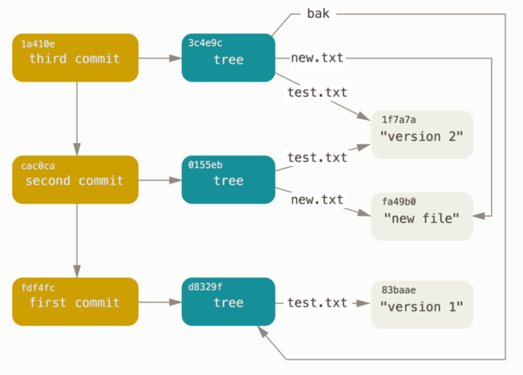

# HaskGit


Team members:

- James Oh
- Jack Oh
- Chen Guo

## Summary Description

HaskGit is a Git implementation crafted in Haskell with the primary objective of providing a lightweight and minimalistic set of Git commands for local file version control.

### Why Haskell to Implement Git?
- A strong type system and functional paradigm help us ensure the correctness of the Git protocol.
- Pure functions are useful for maintaining data integrity in Git.

### How Does Git Work? ###

How does Git track versions of the files? Git manages versions using Git objects stored in `.git/objects`. There are three types of Git objects: *Blob*, representing file content; *Tree*, representing a directory; and *Commit*, which captures a specific snapshot of a project.

In the diagram below, each commit object points to a tree object, and tree objects point to multiple blobs representing the snapshot's directory. Visualize it as a linked list of snapshots, with each commit object serving as a snapshot. Git keeps track of these objects by hashing them and storing them in a directory represented by the hash. All objects are stored in `.git/objects/(first two hash characters)/(rest of the hash characters)`.



While there are more details (such as the *Index* file, which tracks the staging area), this forms the core of how Git operates. HaskGit adheres to this design, utilizing objects and hashes to function as a version control system. 

## Project Execution Summary

### Functionalities

Our team was able to finish all of the MVP features except for git revert (which was discussed with the professor during office hours because it can cause a merge conflict). It implements a number of porcelain and plumbing commands in Git.

The list of implemented porcelain commands is as follows:

- Basic Snapshotting.
  - add: Adds changes to the index (adding to a staging area). The arguments must be relative path to files from the current directory when program is running.
    ```console
    haskgit add filename1 filename2
    ```
  - commit: Creates a new commit containing the current contents of the index. A '-m' flag is required to receive the commit message from the command.
    ```console
    -- '-m' flag is required for MVP
    haskgit commit -m "Some commit message"
    ```
  - reset: Resets the current HEAD to the specified state. HaskGit impelements different types of resets (soft, mixed, hard). 
    ```console
    -- this will unstage all changes
    haskgit reset

    -- Move the branch pointer to specific commit
    haskgit reset commit-hash
    ```
  - status: Displays differences between the index file and the current HEAD commit, paths that have differences between the working tree and the index file, and paths in the working tree that are not tracked by Git. 
  
    Note: Currently, when there is a double nested file, such as *dir1/dir2/file1.txt*, the status function will not be able to detect it as untracked (other statuses such as modified, staged should be detected).
    ```console
    haskgit status
    ```
- Branching and Merging
  - branch: Lists and creates branches.
    ```console
    -- list all the existing branches
    haskgit branch

    -- create new branch
    haskgit branch branch_name
    ```
  - checkout: Switches branches and restores working tree files of that branch. However, our checkout command does not perform **safety** check before checking out to other branch. I.e. if there are uncommitted changes that can be lost by checking out to different branch, the haskgit will not abort the command and you may lose some of your changes.
    ```console
    haskgit checkout branch-name

    haskgit checkout commit-hash  
    ```

    *Note: if checking out to another branch removes all files in a specific directory, we are not handling the removal of those directories (not handling empty directories). For example, if there was a file dir1/test.txt, and a user checks out to a branch that does not include this file, there will be an empty directory, dir1/. This also holds true for a --hard reset, as the working directory could be updated.* 

- Inspection and Comparison
  - show: Shows a git object. In the standard 'git show' behavior, it includes the specified commit and the differences. However, for the project's scope, the diff part will be not displayed.

    ```console
    haskgit show hash_value

    -- show latest commit
    haskgit show  
    ```

  - log: Show commit logs.
      ```console
      haskgit log
      ```

Of course, there are tons of options and flags available in the official Git client that are not present in HaskGit due to the project's scope. Additionally, there are many edge cases that HaskGit cannot cover (e.g., no merge conflicts, so we assume there is either one or zero parent commits, etc.). However, it does contain all the minimal features necessary for users to control the version of files locally. (Note: While `haskgit init` has not been implemented yet, you can set up a `.haskgit` repository using the official Git implementation. Check out the **How to Use HaskGit** section if you are interested in using it.) Please be aware that HaskGit assumes that the user is employing a Unix-like operating system. In the future, we may add compatibility for other operating systems, but, for now, you may not be able to run the program on certain platforms. Also, note that HaskGit does not currently support any configuration setup. Therefore, when you make a commit, it will assume your name and email to be 'Codey Devinson' and 'codey@example.com'.

[Demo](https://youtu.be/tznLdkqjtC4) : Quick demo showing basic functionality of haskgit

### Testing

Due to the nature of the many side effects that Git has, it was very challenging to build a robust set of unit tests. We were able to create unit tests for most of the core functionalities. We attempted to use the `tasty-golden` library to compare the output with the expected output stored in a golden file. However, for some reason, we encountered unexpected behaviors as we added more tests - sometimes the tests passed, and sometimes they did not. We could not pinpoint the exact reason for this issue, but we assumed that when multiple tests output to the stdout, the output could be captured by other test cases (although we could not confirm this). Instead of using the `tasty-golden` library, we reverted to manually reading expected output from files. All of the test data, such as expected output and test Git directories used in `Spec.hs`, can be found under the `test/TestData` directory.

Most of the porcelain commands have unit tests, while the `git add` command is tested by testing the `parseIndex`, `saveIndex`, and `addOrUpdateEntries` functions to avoid issues with file metadata. If these three functions are working correctly, `git add` should exhibit the correct behavior as well. The only porcelain commands that do not have direct unit tests are `git checkout` and `git reset` because these commands involve manipulating the working directory. Recently, we discovered that the `System.Directory` module contains a `setCurrentDirectory` function, meaning that we can set up separate directories just for `git checkout` and `git reset` testing. However, this setup would still require tedious work, and we discovered this a bit late. We still performed thorough manual testing on these features to ensure they are working correctly. We believe this is a reasonable accommodation based on the timeline of the project and the nature of Git software. 

The output of testing for `git checkout` and `git reset` can be found in `test/TestData/test_checkout.txt` and `test/TestData/test_resent.txt`.

The test can be ran using `stack test` command. The expected outputs are:

```console
jo9347@DESKTOP-531QK4A:~/Documents/CS541/HaskGit$ stack test
HaskGit> test (suite: HaskGit-test)

Unit Tests
  gitUpdateRef
    refname hash-value:                   OK
    refname refname:                      OK
    symbolic-ref hash-value:              OK
  hashObejct
    blob object:                          OK
    tree object:                          OK
    commit object:                        OK
  saveObejct
    blob object:                          OK
    tree object:                          OK
    commit object:                        OK
  parseSaveIndex
    parseSaveIndex:                       OK
  gitListBranchTest
    gitListBranchTest:                    OK
    gitListBranchTest:                    OK
    gitListBranchTest:                    OK
  addOrUpdateEntriesTests
    added files to the entries:           OK
  gitReadTreeTests
    Check path for case 1:                OK
    Check the hashes are same for case 1: OK
    Check path for case 2:                OK
    Check the hashes are same for case 1: OK
    Check path for case 1:                OK
    Check the hashes are same for case 1: OK
  gitCommitTests
    Check commit object:                  OK
  gitStatus
    Working tree clean:                   OK

All 22 tests passed (0.00s)


HaskGit> Test suite HaskGit-test passed
```


### How to Use HaskGit
Because HaskGit does not have an init command, and it is not yet handling when there is no commit, we need to first initialize repository with official git. Below is an example how you can set up.

```console
> stack build

-- Exec might differ based on the operating system
-- Copy it to where you want to save it.
> cp .stack-work/dist/x86_64-linux/Cabal-3.8.1.0/build/HaskGit-exe/HaskGit-exe ../some_path_you_want/haskgit

-- Create an empty directory to use as a HaskGit repository
> mkdir demo
> cd demo

-- You can also set up alias (recommended)
> alias haskgit='../some_path/haskgit'

-- HaskGit does not have an 'init' command, so set it up with Git
-- Need to initiate a single commit with Git to set up the index and other appropriate Git files
> git init
> cat >> filename.text
some text
> git add filename.txt
> git commit -m "first commit"

-- Create .haskgit directory
> cp -r .git .haskgit
> rm -rf .git

-- If you need to update permission:
> chmod -R a+rwx .haskgit

-- Ready for haskgit!
> haskgit status

On branch master

nothing to commit, working tree clean

```

## Additional Details

### Libraries

- **base16-bytestring:** Used for base16 encoding for SHA-1 hash.
- **bytestring:** Used for interacting with bytestring data.
- **zlib:** Compression library that Git uses.
- **cryptohash-sha1:** SHA-1 hash.
- **directory:** Used for finding the current Git directory.
- **filepath:** Used for file paths.
- **parsec:** Used for parsing Git object files and Git index files.
- **time:** Needed for UTC time.
- **Tasty:** Testing framework.
- **zlib:** Compression library that Git uses.
- **unix:** Package that provides POSIX functionalities (e.g., Unix time).
- **containers:** `Data.Map` is used to store directory-to-file mappings when traversing the tree in the `writeTree` function.
- **Glob:** Matching patterns against file paths. This package was added later to this project but can definitely be used in many places in the project.
- **tasty/tasty-golden/tasty-hunit/tasty-quickcheck:** Tasty framework, although we are not using `tasty-golden` anymore.
- **text:**
- **silently:** Used for capturing output from stdout when testing.
- **shelly:** Used for exploring options for shell script testing (not currently used in the project).

### Code Structure

The structure of the HaskGit code is as follows:

```
src/
|   |-- GitObject.hs -- types, parsers, and functions related to Git objects
|   |-- Refs.hs -- types and functions related to References
|   |-- Index.hs -- types, parsers, and functions related to Index
│   │-- HaskGit.hs -- functions for all git porcleain and plumbing commands, and some helpers
|   |-- Util.hs -- utility functions that do not fit in other files
|   |-- Experiment.hs -- just a playground for an experiment (planning to delete it in the future)
app/
|
│   |-- Main.hs -- main executable
|
|test/
│   |-- Spec.hs -- Unit tests (may get separeted into multiple files in the future)
│   |-- TestData -- Data files for testing
```

We structured our code to follow the logical abstraction of the Git protocol.

Some of our GitObject types look like:

```haskell
-- | GitBlob = (byteSize, file content in binary)
type GitBlob = (Int, String)

-- | GitTree = (byteSize, [(filemode bits, name of file/directory, sha1 hash)])
-- Filemode bits are stored in octal ASCII representation for the tree.
type GitTree = (Int, [(String, String, GitHash)])

-- | GitAuthor = (name, email, date - unix time in seconds, timezone string)
type GitAuthor = (String, String, Int, String)

-- | GitCommitter = (name, email, date - unix time in seconds, timezone string)
type GitCommitter = (String, String, Int, String)

-- | GitCommit = (bytesize, tree hash, parent hashes, author, committer, message)
type GitCommit = (Int, GitHash, [GitHash], GitAuthor, GitCommitter, String)

data GitObject = Tree GitTree | Commit GitCommit | Blob GitBlob
```

### Challenges/Lessons

#### Base 16 Encoding

In the initial phase of the project, we used a `ByteString` type to represent the hash value. We encountered multiple bugs related to the representation of the SHA-1 hash for several days. Apparently, the reason was that some Git objects (aka commit objects) store a base16-encoded hash value, while the index file and other Git objects (aka tree objects) store a non-encoded hash value. This led to incorrect hash values in multiple places when staging files to the index. We learned, in a painful way, to have a really good understanding of how binary data is actually stored when interacting with it.

Decompressed Commit Object File
```console
commit 324tree ffbd2857601591b36c4d079f78164693f48c0bde
parent 103d961cace5383c7a633b861a220fd0de2aa743
parent 741fc5eec951001c17501f87522c073b5778ce1b
author James Oh <jo9347@cs.rit.edu> 1702948584 -0500
committer James Oh <jo9347@cs.rit.edu> 1702948584 -0500

Merge branch 'main' of git.cs.rit.edu:psh2231/project/HaskGit into main
```

Decompressed Tree Object Files
```console
tree 690100644 .gitattributes�:�P��SFO��Z6��sBh100644 .gitignoreر������ݻ���wD8�100644 .hlint.yaml��7�/$�9��_A
40000 .vscode�T�z       @+ڔ�?��
[[100644 CHANGELOG.md��%k���x
                             1�ڗ���@`100644 HaskGit.cabal�=V�u��KVo�U��N�+�4�100644 README.md��A$ϥ��^Mu��+�100644 Set��Xk�D�e�ۧC�40000 assets��Mxa�瀴ayp�Hʈ�،40000 docs�CC^�yM��J�1S|�R�40000 experiments�$F�&"`{�?��100644 newfile�⛲��CK�)�wZ���S�100644 original_index�l��˸t��|}�xU�>�100644 out.outZ
                                                             l5�;1���5��W��j100644 package.yamlC<.����
                                                                                                      ^���      $�40000 srcP�!�V_>�U�$�q�N%�]@100644 stack.yamlK���+�3$��c���i40000 test�o�<z4vL�2i���t�?
```

You can see commit objects store hash values in a readable hexadecimal format, while tree objects do not.

To overcome this challenge, we decided to follow the invariant that the `GitHash` type will always contain a ByteString that is encoded in base16. This means that we need to perform encoding/decoding when parsing/writing to the index file. The sha1 hash value contains 160 bits (20 bytes), and when it is encoded in base-16 format, it contains 320 bits (40 bytes).

```Haskell
newtype GitHash = GitHash ByteString
  deriving (Eq, Ord, Show)

-- | Constructor that takes a ByteString and returns a GitHash
-- The length is 40 even though sha1 return 160 bits because it is encoded in hexadecimal format
-- I.e. 160 bits converted to hexadecimal -> 4 bits become 8 bits, therefore 320 bits -> 40 bytes
-- - @bs@: the length of bs should be exactly equal to 40
bsToHash :: ByteString -> Maybe GitHash
bsToHash bs = if BS.length bs == 40 then Just (GitHash bs) else Nothing
```

After using the GitHash type extensively, we were able to catch similar types of bugs early on. We believe this is a good use case of Haskell's feature.

The representation of the hash value in our system can be summarized as follows:

- The SHA function returns a ByteString that is not encoded in base16.
- Commit object files store the hash that is encoded in base16.
- Tree object files store the hash that is not encoded in base16.
- The index stores the hash value that is not encoded in base16.
- Our invariant: `GitHash` stores the ByteString that is encoded in base16.

#### Shadowing + Lazy Evaluation

We actually encountered an interesting bug that seemed bizarre for a long time. The following lines are pinpointed from our project at some point. What do you think will happen with the following lines?

```Console
ghci> l = "dafdkjlaksdjfa\n"
ghci> branchP = Prelude.filter (/= '\n') l
ghci> branchP = if Prelude.last branchP == '\n' then Prelude.init branchP else branchP
ghci> branchP
```

The answer is that this code never terminates!

The reason why this happens is due to lazy evaluation in combination with shadowing. In a non-lazy language, on the third line, we would think that `branchP` on the right-hand side would be equal to `Prelude.filter (/= '\n') l`. However, because Haskell is a lazily evaluated language, on the third line, `branchP` is bound to its right-hand side, which makes it a recursive definition! Alas, the code never terminates! What is the lesson? If you can, try to avoid shadowing in Haskell because you might make the same mistakes as us.

#### Lazy Evaluation in File I/O

When working on tests, there were cases where we needed to read and write to the same file to preserve the original content (e.g., after `gitUpdateRef` changes the ref file, we want to revert to the original so that the next test remains valid). However, due to lazy evaluation in Haskell, errors occurred because the file was being accessed while still in the process of being updated. For this reason, we opted to use strict IO in these cases. More information can be found on [this page](https://stackoverflow.com/questions/5053135/resource-busy-file-is-locked-error-in-haskell).

We used the [`readFile'`](https://hackage.haskell.org/package/base-4.19.0.0/docs/System-IO.html#:~:text=The%20readFile%27-,function,-reads%20a%20file) function, which reads a file strictly. Also, to compress and decompress, we used the zlib library, which takes lazy bytestrings (Data.ByteString.Lazy.Char8) as input. This also caused a similar issue during testing, so the files were first read using strict bytestrings (Data.ByteString.Char8) and then converted to lazy bytestrings.

#### Other challenges

- Because Git inherently involves many side effects, it was challenging to separate pure and IO functions. To overcome this challenge, we first focused on implementing small features in Git (e.g., `git show`) and observed patterns to refactor the pure parts of the code.
- Our team also faced a learning curve in understanding the low-level details of the Git protocol, such as how the index file is formatted and what metadata we need to know. Even a tiny typo could cause bugs that were hard to detect. However, we managed this better by leveraging Haskell's strong type system.
- Testing was particularly challenging and required tedious work, such as setting up a test repository.


### Idiomatic Haskell Features

A lot of our codebase requires the `IO` monad, which may not seem as idiomatic Haskell. However, we were still able to find a lot of useful features in Haskell.

1. Building up the parser was logically intuitive. The following function is a parser that parses the index file, which is built on top of other parsers.

```haskell
-- | Parse index file (which is in binary format)
-- Ignoring the extension data for now
parseIndexFile :: Parser GitIndex
parseIndexFile = do
  -- 4-byte signature (DIRC)
  _ <- string "DIRC"
  -- 4-byte version number (our mvp only takes version 2)
  _ <- string "\0\0\0\2"
  numEntries <- parseInt32
  entries <- count numEntries parseGitIndexEntry
  -- Ignoring the extensions and cache tree
  return (GitIndex entries)
```

2. We were also able to leverage the [`Data.Map`](https://hackage.haskell.org/package/containers-0.4.0.0/docs/Data-Map.html) and [`Data.Set`](https://hackage.haskell.org/package/containers-0.7/docs/Data-Set.html) modules, both of which are implemented with a size-balanced binary tree. The `Set` data structure was useful for extracting the maximum value from the data structure in O(log(n)) time, and the `Map` data structure was useful for finding key-value pairs in O(log(n)) time.

Data.Map: insertion = O(log(n)), lookup = O(log(n)), member = O(log(n))
Data.Set: maxView = O(log(n)), insert = O(log(n))

```haskell
traverse :: Set.Set (Int, [Char]) -> Map.Map FilePath [(String, FilePath, GitHash)] -> IO (Maybe GitHash)
traverse ks dict = do
  -- O(log(n))
  case Set.maxView ks of
    Nothing -> return Nothing
    Just ((_, k), lks) -> do
      -- Also sort the entries based on the name (tree object file stores entries in sorted order)
      let tree = Tree (0, sortOn (\(_, name, _) -> name) (dict Map.! k))
      treeHash <- hashAndSaveObject tree gitDir
      let parentDir = takeDirectory k
      case k of
        -- Finished traversing the keys, return the hash of the root tree object (base case)
        "." -> return $ Just treeHash
        _ -> do
          entries <-
            if Map.member parentDir dict
              then do
                let (Just entries) = Map.lookup parentDir dict
                return entries
              else return []
          let newEntries = (printf "%02o%04o" (0o040000 :: Int) (0o0755 :: Int), takeFileName k, treeHash) : entries

          -- Add the new tree object to the dict and new key to the set (both O(log(n)))
          let newDict' = Map.insert parentDir newEntries dict
          let newKs = Set.insert (length parentDir, parentDir) lks
          traverse newKs newDict'
```


### Abandoned Approaches

- As mentioned in the 'Testing' section, we decided not to use the `tasty-golden` library because of undefined behavior.
- During the proposal phase, we initially wanted to use the 'Functional core, imperative shell' approach. However, due to the nature of Git having many side effects, we decided to move away from such an approach.
- We used to have a `GitParser.hs` file that contained all the parsers. However, based on the questions we received during the checkpoint, it may seem logically odd that the `saveGitObject` and `parseGitObject` functions are not in the same file. As a result, we decided to move parsers related to GitObjects to `GitObject.hs` and parsers related to the index file to `Index.hs`.

### Conclusion

This project was challenging to complete within a couple of weeks during the semester, but we believe our team accomplished our goal of building a minimalistic Git implementation with Haskell. We had to delve into dealing with binary files and overcome some tough bugs, but we made it through. This project compelled us to write tons of Haskell code, making us more comfortable working with it and deepening our understanding of how Git works. Along the way, we learned other valuable lessons mentioned above. We believe that our project demonstrates how Haskell can bring beneficial features to IO-heavy software, showcasing the language's extensibility. Overall, it was enjoyable to work on a project to replicate the software we use daily with a purely functional language!
